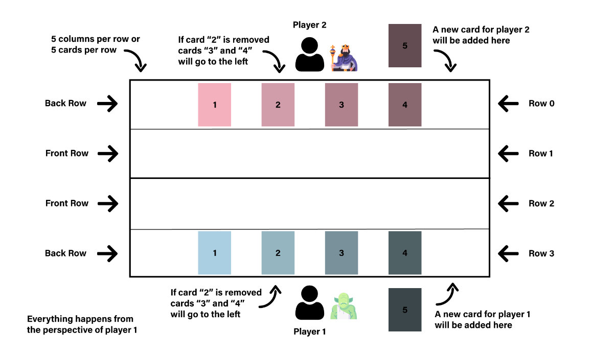

## Card Game - GwentStone

Card game back-end in the style of Gwent and Hearthstone, where players can use cards with different abilities to damage the adversary cards or hero. The code is written in Java and 
was an assigment for the Object-Oriented Programming Course. The text of the assigment can be found [here](https://ocw.cs.pub.ro/courses/poo-ca-cd/arhiva/teme/2022/tema).

### Game Overview

The game is designed to be played in two. Before it starts, the players can choose a deck to bring in game, their hero is selected and the starting player is chosen at random 
(as it is a turn-based game). At the beginning of a round the players receive mana to be spent on casting cards. They also receive a card from the deck.

There are two different types of cards in the deck: normal and environment. The normal ones can be placed on the game table, while the environment ones can affect an entire row 
on it. The players' heroes have special abilities that can affect rows on the table. At the same time,
the normal cards placed on the table can attack heroes. The game is over when one of the players hero's life reaches 0.

The program also keeps statistics on the players' number of won and lost games.

### The Game Table

Each player has two rows on the game table where they can place their cards and each row can contain at most 5 cards. Cards are added from left to right and if a card is killed,
the cards on its right will be shifted to the left. Here is a screenshot of the layout of the game table:

### Usage

The program receives the players' starting decks and their actions in the game in the form of a list of JSONs in different test files which have the purpose to simulate the 
running of the game. The program can also receive debug commands in the same manner to show information on the state of the game.

### Code Content

Information on how the code was implemented and structured can be found in the README file inside the "tema" folder (or can be accessed [here](./tema/README.md)). Keep in mind
that in the present this file is written in romanian.

### What I learned

This project was a great practice for organizing the code in packages based on the hierarchy and on the relations between classes, given the variety of cards and actions in the game.
I was able to gain experience on working with OOP concepts, like inheritance, encapsulation and polymorphism. Moreover, it was a good mind practice to construct the multitude of 
interactions between different elements of the game.
